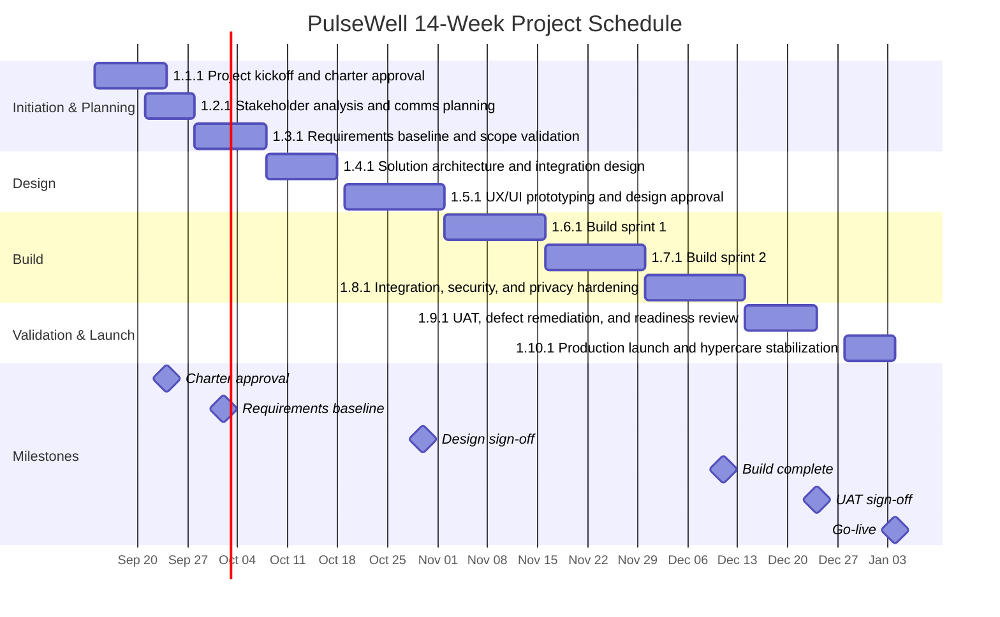

# D5: PROJECT SCHEDULE & GANTT CHART
## PulseWell Digital Intake & Client Experience Portal

**Document Version:** 1.0  
**Last Updated:** [Date]  
**Project:** PulseWell Digital Intake & Client Experience Portal  
**Prepared By:** Jennifer Johnson  
**Role:** Project Manager & Data Analyst  
**Status:** Draft / Approved  

---

## DOCUMENT OVERVIEW

This project schedule aligns the 14-week delivery plan with the approved WBS structure and major project milestones. The schedule is organized around a phased approach that begins with project initiation and requirements, progresses through design and build, and concludes with validation, launch, and hypercare.

**Planning Horizon:** 14 Weeks  
**Project Start:** Week 1  
**Target Go-Live:** Week 14  
**Critical Path Focus:** Requirements approval, design sign-off, build completion, UAT sign-off, launch readiness

---

## 1. WBS-ALIGNED SCHEDULE SUMMARY

### WBS Reference Set
- 1.1.1 Project kickoff and charter approval
- 1.2.1 Stakeholder analysis and communication planning
- 1.3.1 Requirements baseline and scope validation
- 1.4.1 Solution architecture and integration design
- 1.5.1 UX/UI prototyping and design approval
- 1.6.1 Build sprint 1: core intake and assessment flows
- 1.7.1 Build sprint 2: client dashboard and recommendations
- 1.8.1 Integration, security, and data privacy implementation
- 1.9.1 UAT, defect remediation, and readiness review
- 1.10.1 Production launch and hypercare stabilization

---

## 2. 14-WEEK PROJECT SCHEDULE

| Week | Period | Focus Area | WBS Reference | Key Deliverables |
|------|--------|------------|---------------|------------------|
| 1 | Week 1 | Project kickoff and mobilization | 1.1.1 | Project charter, kickoff meeting, governance setup, initial risk register |
| 2 | Week 2 | Stakeholder alignment and scope confirmation | 1.2.1 | Stakeholder map, communication matrix, decision log |
| 3 | Week 3 | Requirements baseline development | 1.3.1 | Business requirements approved, user stories refined, acceptance criteria baseline |
| 4 | Week 4 | Architecture and technical design | 1.4.1 | Solution architecture, integration blueprint, security and privacy design |
| 5 | Week 5 | UX/UI prototyping | 1.5.1 | User journeys, wireframes, interactive mockups, design review |
| 6 | Week 6 | Design approval and sprint planning | 1.5.1 | Approved prototype, backlog finalization, sprint plan |
| 7 | Week 7 | Build sprint 1 | 1.6.1 | Intake workflow, form validation, assessment logic foundation |
| 8 | Week 8 | Build sprint 1 completion | 1.6.1 | Core portal functionality validated in test environment |
| 9 | Week 9 | Build sprint 2 | 1.7.1 | Client dashboard, progress tracking, recommendations engine |
| 10 | Week 10 | Build sprint 2 completion | 1.7.1 | Dashboard features complete, business logic validated |
| 11 | Week 11 | Integration, security, and privacy hardening | 1.8.1 | CRM/billing integration, RBAC, encryption, data controls |
| 12 | Week 12 | Integration completion and quality testing | 1.8.1 | Full end-to-end integration testing, performance tuning |
| 13 | Week 13 | UAT, defect remediation, sign-off | 1.9.1 | UAT execution, issue triage, go-live approval package |
| 14 | Week 14 | Go-live and hypercare | 1.10.1 | Production deployment, launch monitoring, hypercare stabilization |

---

## 3. DEPENDENCY MATRIX (WBS 1.1.1 TO 1.10.1)

The dependency matrix below maps the logical sequence of project activities and confirms predecessor/successor relationships across the WBS.

| WBS ID | Activity | Predecessor(s) | Successor(s) | Dependency Type |
|--------|----------|----------------|--------------|----------------|
| 1.1.1 | Project kickoff and charter approval | — | 1.2.1, 1.3.1 | Start/mandatory |
| 1.2.1 | Stakeholder analysis and communication planning | 1.1.1 | 1.3.1, 1.8.1 | Informational/operational |
| 1.3.1 | Requirements baseline and scope validation | 1.1.1, 1.2.1 | 1.4.1, 1.5.1 | Critical path |
| 1.4.1 | Solution architecture and integration design | 1.3.1 | 1.5.1, 1.6.1, 1.8.1 | Critical path |
| 1.5.1 | UX/UI prototyping and design approval | 1.3.1, 1.4.1 | 1.6.1, 1.7.1 | Critical path |
| 1.6.1 | Build sprint 1: core intake and assessment flows | 1.4.1, 1.5.1 | 1.7.1, 1.8.1 | Critical path |
| 1.7.1 | Build sprint 2: client dashboard and recommendations | 1.5.1, 1.6.1 | 1.8.1, 1.9.1 | Critical path |
| 1.8.1 | Integration, security, and data privacy implementation | 1.4.1, 1.6.1, 1.7.1 | 1.9.1, 1.10.1 | Critical path |
| 1.9.1 | UAT, defect remediation, and readiness review | 1.7.1, 1.8.1 | 1.10.1 | Critical path |
| 1.10.1 | Production launch and hypercare stabilization | 1.8.1, 1.9.1 | — | Final gate |

### Dependency Logic Summary
- Project initiation must be completed before stakeholder alignment and requirements begin.
- Requirements approval is a mandatory predecessor for architecture, UX, and build activities.
- Design and architecture must be approved before the build sprints can progress without rework risk.
- Integration, security, and data privacy work run in parallel with build completion and must finish before UAT and launch.
- UAT sign-off is the final approval gate before production deployment and hypercare.

---

## 4. CRITICAL PATH NARRATIVE

The critical path for this project is:

1.1.1 → 1.3.1 → 1.4.1 → 1.5.1 → 1.6.1 → 1.7.1 → 1.8.1 → 1.9.1 → 1.10.1

This path emphasizes the dependency between scope clarity, design completion, implementation quality, and final release approval. Delays in any critical step will impact the final go-live date and launch readiness window.

---

## 5. MERMAID GANTT CHART

---

## 6. ASSUMPTIONS

- Weekly project cadence assumes a standard 5-day development cycle and a dedicated PMO/governance function.
- Design review and business stakeholder approval are available on schedule during Weeks 5 and 6.
- External integrations require API readiness and data access approvals during the design and build phases.
- UAT duration assumes a limited defect backlog and controlled change request management.
- Production launch is targeted for the start of the following reporting period after final sign-off.

---

## 7. PROJECT MILESTONES

| Milestone | Target Week | WBS Reference | Description |
|-----------|-------------|---------------|-------------|
| Project kickoff | Week 1 | 1.1.1 | Governance, scope alignment, and project mobilization |
| Requirements baseline approved | Week 3 | 1.3.1 | Business scope locked and acceptance criteria confirmed |
| Architecture and design sign-off | Week 5 | 1.4.1 / 1.5.1 | Technical solution and UX approved |
| Build complete | Week 10 | 1.6.1 / 1.7.1 | Core portal and dashboard capabilities completed |
| Integration and security complete | Week 12 | 1.8.1 | Platform hardening and technical readiness complete |
| UAT sign-off | Week 13 | 1.9.1 | Final functional validation and stakeholder approval |
| Go-live | Week 14 | 1.10.1 | Production deployment and stabilization |

---

## 8. SIGN-OFF

| Role | Name | Signature | Date |
|------|------|-----------|------|
| Project Sponsor | [Sponsor Name] | ________________ | ______ |
| Project Manager | Jennifer Johnson | ________________ | ______ |
| PMO Lead | [Name] | ________________ | ______ |
| Technical Lead | [Name] | ________________ | ______ |
| QA Lead | [Name] | ________________ | ______ |

---

**Document Classification:** Internal - Confidential  
**Last Updated:** [Date]  
**Next Review Date:** [Date]
