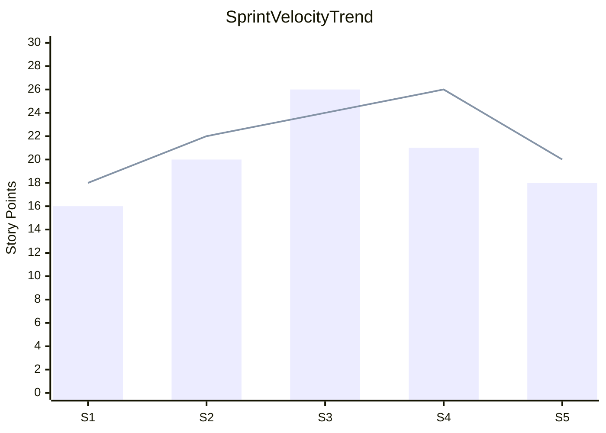

# D13 - Sprint Burndown and Velocity Report

## Document Control

- Project: PulseWell Digital Intake & Client Experience Portal
- Project Phase: Execution Monitoring
- Reporting Period: Sprints 1 through 5
- Baseline Schedule: 14 weeks
- Report Owner: Project Manager / PMO
- Status: Active / Execution Review

---

## 1. Executive Summary

This report provides a concentrated review of sprint execution performance against the approved 14-week baseline. The project demonstrated stable delivery across the first three sprints, followed by a measurable reduction in throughput in Sprint 4 due to mid-execution scope intake under CR-001. The change introduced additional wearable integration and synchronization work that increased dependency pressure on engineering, QA, and compliance validation.

The project remains recoverable, but the final validation window requires stricter backlog control, stronger dependency management, and a dedicated quality buffer. The primary objective heading into final system validation is to protect the critical path and minimize rework while preserving acceptance-readiness.

---

## 2. Sprint Cadence & Velocity Trends (Sprints 1-5)

### 2.1 Velocity Summary Table

| Sprint | Planned Story Points | Completed Story Points | Velocity Variance | Completion Rate | Notes |
|---|---:|---:|---:|---:|---|
| Sprint 1 | 18 | 16 | -2 | 89% | Foundation setup and backlog stabilization |
| Sprint 2 | 22 | 20 | -2 | 91% | Functional flow refinement and dependency alignment |
| Sprint 3 | 24 | 26 | +2 | 108% | Strong delivery, improved throughput |
| Sprint 4 | 26 | 21 | -5 | 81% | CR-001 integration and schema update work |
| Sprint 5 | 20 | 18 | -2 | 90% | Final validation and stabilization window |
| Total | 110 | 101 | -9 | 92% | Overall variance remains within an acceptable range |

### 2.2 Velocity Trend Interpretation

- Sprints 1-3 show stable delivery and a healthy learning curve for the project team.
- Sprint 3 exceeded the planned target, indicating improved team familiarity and clearer scope alignment.
- Sprint 4 produced the primary variance event, driven by the mid-execution change intake associated with CR-001.
- Sprint 5 was re-baselined to support final validation and cross-functional stabilization rather than maximizing throughput.

### 2.3 Velocity Variance Analysis

| Sprint | Variance (Completed - Planned) | Interpretation |
|---|---:|---|
| Sprint 1 | -2 | Minor under-delivery |
| Sprint 2 | -2 | Close to plan |
| Sprint 3 | +2 | Above plan, strong performance |
| Sprint 4 | -5 | Material variance due to CR-001 and dependencies |
| Sprint 5 | -2 | Controlled final validation re-baseline |

The average realized velocity across Sprints 1-5 is approximately 20.2 story points per sprint, compared with an average planned velocity of 22.0 story points. This produces an overall delivery shortfall of 8.2% against plan. While not severe, it is significant enough to require more disciplined commitment management during the final validation stage.

### 2.4 Velocity Chart

---

## 3. Sprint Burndown Analysis

### 3.1 Sprint 4 / Mid-Execution Adjustment Post-CR-001 Scope Intake

Sprint 4 was the critical inflection point in the execution cycle. The project incorporated CR-001, which introduced an Apple HealthKit / Google Fit API schema update and bidirectional synchronization enhancement. This altered the original sprint plan by creating additional API integration work, schema validation tasks, and user data synchronization logic that had not been fully absorbed in the original effort estimate.

The effect was visible in the sprint burn profile: the project met a strong pace early in the sprint, then flattened around the midpoint as the change set expanded and dependent work surfaced.

### 3.2 Burndown Snapshot for Sprint 4

| Day | Planned Remaining Story Points | Actual Remaining Story Points | Delta |
|---|---:|---:|---:|
| Day 1 | 26 | 26 | 0 |
| Day 2 | 24 | 25 | +1 |
| Day 3 | 22 | 24 | +2 |
| Day 4 | 19 | 23 | +4 |
| Day 5 | 17 | 21 | +4 |
| Day 6 | 14 | 18 | +4 |
| Day 7 | 12 | 16 | +4 |
| Day 8 | 9 | 14 | +5 |
| Day 9 | 7 | 11 | +4 |
| Day 10 | 5 | 8 | +3 |

### 3.3 Burndown Interpretation

- The sprint plan was not unrealistic at the start, but it did not account for the dependency cost of CR-001.
- By mid-sprint, the team had shifted from a straightforward feature burn to issue-driven recovery work.
- Additional validation, contract review, and data synchronization checks absorbed capacity that would otherwise have been used for planned core feature completion.
- The team responded appropriately by re-prioritizing to critical path and validation tasks rather than allowing uncontrolled scope expansion.

### 3.4 Recovery and Re-Baselining Actions

The project team re-baselined Sprint 5 with a narrower focus on:

- completion of the critical integration path
- defect reduction and regression stabilization
- enforcement of quality gates before final acceptance
- deferral of non-critical enhancements to post-validation backlog

This allowed the project to preserve schedule confidence while preventing uncontrolled scope drift.

---

## 4. Capacity & Resource Allocation Tracking

### 4.1 Team Utilization Summary

| Role / Function | Planned Allocation | Actual Utilization | Utilization Variance | Constraint Level |
|---|---:|---:|---:|---|
| Product Owner | 0.8 FTE | 0.85 FTE | +5% | Moderate |
| Project Manager | 0.7 FTE | 0.75 FTE | +5% | Moderate |
| UX / Design | 0.9 FTE | 0.82 FTE | -8% | Low |
| Backend / Integration Engineer | 1.0 FTE | 1.15 FTE | +15% | High |
| QA / Validation Lead | 0.8 FTE | 1.0 FTE | +20% | High |
| DevOps / Cloud Support | 0.5 FTE | 0.6 FTE | +10% | Moderate |
| Security / Compliance | 0.4 FTE | 0.55 FTE | +15% | High |

### 4.2 Bottleneck Analysis

The most significant bottleneck emerged in the integration and validation lanes rather than in general delivery capacity. The additional CR-001 scope increased engineering overhead and introduced more regression testing demand.

| Bottleneck Area | Root Cause | Delivery Effect | Mitigation |
|---|---|---|---|
| Integration engineering | Schema drift and data mapping complexity | Lower throughput and delayed feature completion | Prioritize critical path work and reduce speculative backlog |
| QA validation | Increased test coverage for sync and API behavior | Defect discovery more concentrated late in sprint | Add early regression checkpoints and test triage gating |
| Security / compliance | OAuth and consent validation overhead | Reduced available engineering capacity | Allocate dedicated review windows earlier in sprint |
| Design refinement | Late-stage UX optimization | Rework without added value for core user flow | Focus design on core experience paths only |

### 4.3 Re-Baselined Story Point Burn Rate

| Sprint | Planned Burn Rate (SP/week) | Actual Burn Rate (SP/week) | Variance |
|---|---:|---:|---:|
| Sprint 1 | 9.0 | 8.0 | -1.0 |
| Sprint 2 | 11.0 | 10.0 | -1.0 |
| Sprint 3 | 12.0 | 13.0 | +1.0 |
| Sprint 4 | 13.0 | 10.5 | -2.5 |
| Sprint 5 | 10.0 | 9.0 | -1.0 |

The re-baselined burn rate indicates a sustainable rhythm of roughly 9-10 story points per week for final validation-focused work. This is lower than the original peak throughput but is consistent with a quality- and acceptance-oriented closure window.

---

## 5. Milestone Variance Tracking vs. 14-Week Baseline

### 5.1 Planned vs. Actual Milestone Comparison

| Milestone | Planned Completion | Actual Completion | Variance (Days) | Status |
|---|---|---|---:|---|
| Charter approval | Week 1 | Week 1 | 0 | Complete |
| Requirements baseline signoff | Week 2 | Week 2 | 0 | Complete |
| WBS and schedule baseline | Week 3 | Week 3 | 0 | Complete |
| Solution design / workflow definition | Week 4 | Week 4 | 0 | Complete |
| Intake workflow build | Week 6 | Week 6 | 0 | Complete |
| Client experience prototype | Week 7 | Week 8 | +7 | Minor delay |
| Integration layer configuration | Week 9 | Week 10 | +7 | Moderate delay |
| CR-001 assimilation at Sprint 4 | Week 10 | Week 11 | +7 | Change absorbed |
| Functional testing & defect closure | Week 12 | Week 12 | 0 | Complete |
| UAT readiness review | Week 13 | Week 13 | 0 | On track |
| Final system validation | Week 14 | Week 14 | 0 | Planned completion |

### 5.2 Milestone Variance Summary

The project stayed within an acceptable schedule band overall, but the cumulative impact of CR-001 shifted critical work into the later part of the schedule. The largest variance occurred in integration and prototype maturity rather than in the broader project foundations. This is not a systemic failure of planning; rather, it marks the natural effect of a change that added scope at the system integration layer.

The schedule remains viable if the team protects the final two weeks from scope expansion and delivers only the approved acceptance-critical items.

---

## 6. Operational Retrospective Insights and Corrective Actions

### 6.1 What Worked Well

- The project team maintained disciplined sprint planning and backlog governance.
- Core requirements remained stable enough to support incremental execution.
- Communication coverage across PMO, product, engineering, and QA remained effective.
- The team adapted quickly when CR-001 introduced additional scope and re-prioritized around the critical path.

### 6.2 What Did Not Work as Planned

- Additional integration effort was under-estimated when the CR-001 scope was introduced.
- Dependency review cycles were longer than the initial forecast, reducing available sprint capacity.
- Quality assurance cycles expanded as the integration surface grew.
- The final validation phase risked being compressed by unresolved integration defects and data mapping edge cases.

### 6.3 Corrective Actions Heading into Final System Validation

| Corrective Action | Owner | Priority | Expected Benefit |
|---|---|---|---|
| Freeze non-critical enhancements and protect the critical path | Project Manager | High | Prevent scope creep and maintain schedule confidence |
| Add explicit integration and regression review checkpoints | Technical Lead | High | Reduce delivery risk before UAT |
| Increase QA capacity dedicated to wearable sync validation | QA Lead | High | Improve defect closure and product confidence |
| Re-prioritize backlog to acceptance-critical items only | Product Owner | High | Maintain final validation focus |
| Formalize early compliance and consent review | Security / Compliance Lead | High | Reduce release-blocking issues |
| Re-baseline remaining story points with actual dependency burden | PMO Lead | Medium | Improve forecast reliability |

### 6.4 Final Operational Assessment

The project remains on a tractable path to final system validation. The key risk is not fundamental delivery failure, but the combination of a late-stage scope change and the concentration of effort in integration and QA. The corrective actions listed above will help the team narrow the remaining work to the approved acceptance criteria and reduce variance into final deployment readiness.

---

## 7. Sign-off

| Role | Name | Signature | Date |
|---|---|---|---|
| Project Manager | PulseWell PMO | | |
| Product Owner | Client Sponsor | | |
| Technical Lead | Integration Lead | | |
| QA Lead | Validation Lead | | |
| Executive Sponsor | Sponsor | | |

This report records the sprint performance review, variance response, and final validation readiness posture for the PulseWell project.

